# B2 Native RC Interface 架构指南

本文档使用 Mermaid 图表详细介绍项目的架构、数据流和实现细节，帮助理解项目设计。

> 本项目与 Unitree 官方 SDK 完全兼容，代码风格和命名规范遵循官方文档：
> - [获取遥控器状态](https://support.unitree.com/home/zh/B2_developer/Get%20Remote%20Control%20Status)

---

## 📋 目录

1. [项目概述](#1-项目概述)
2. [官方兼容性对照](#2-官方兼容性对照)
3. [系统架构图](#3-系统架构图)
4. [节点与话题关系](#4-节点与话题关系)
5. [数据流详解](#5-数据流详解)
6. [消息结构设计](#6-消息结构设计)
7. [核心类设计](#7-核心类设计)
8. [摇杆数据处理流程](#8-摇杆数据处理流程)
9. [按键解析流程](#9-按键解析流程)
10. [项目文件结构](#10-项目文件结构)
11. [启动流程](#11-启动流程)

---

## 1. 项目概述

### 1.1 项目目标

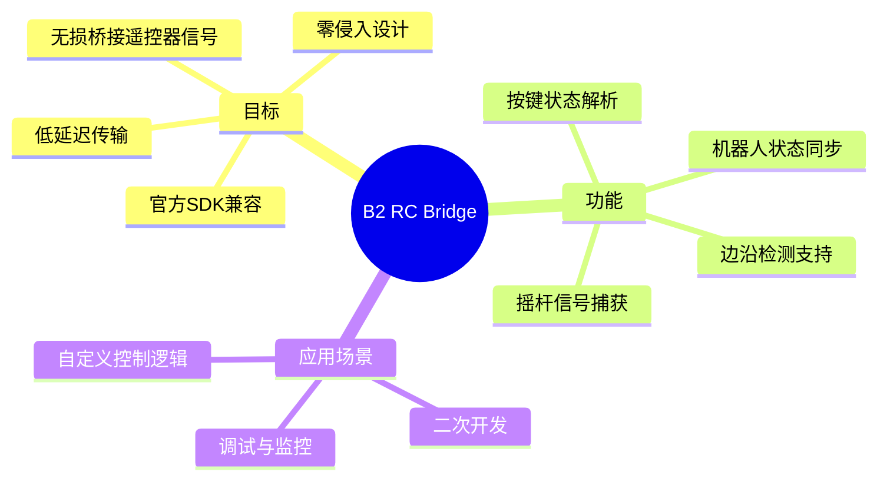
```mermaid
mindmap
  root((B2 RC Bridge))
    目标
      无损桥接遥控器信号
      低延迟传输
      零侵入设计
      官方SDK兼容
    功能
      摇杆信号捕获
      按键状态解析
      机器人状态同步
      边沿检测支持
    应用场景
      二次开发
      自定义控制逻辑
      调试与监控
```

### 1.2 设计原则

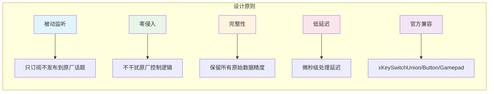
```mermaid
graph LR
    subgraph 设计原则
        A[被动监听] --> B[只订阅不发布到原厂话题]
        C[零侵入] --> D[不干扰原厂控制逻辑]
        E[完整性] --> F[保留所有原始数据精度]
        G[低延迟] --> H[微秒级处理延迟]
        I[官方兼容] --> J[xKeySwitchUnion/Button/Gamepad]
    end
    
    style A fill:#e1f5fe
    style C fill:#e8f5e9
    style E fill:#fff3e0
    style G fill:#fce4ec
    style I fill:#f3e5f5
```

---

## 3. 系统架构图

### 3.1 整体架构

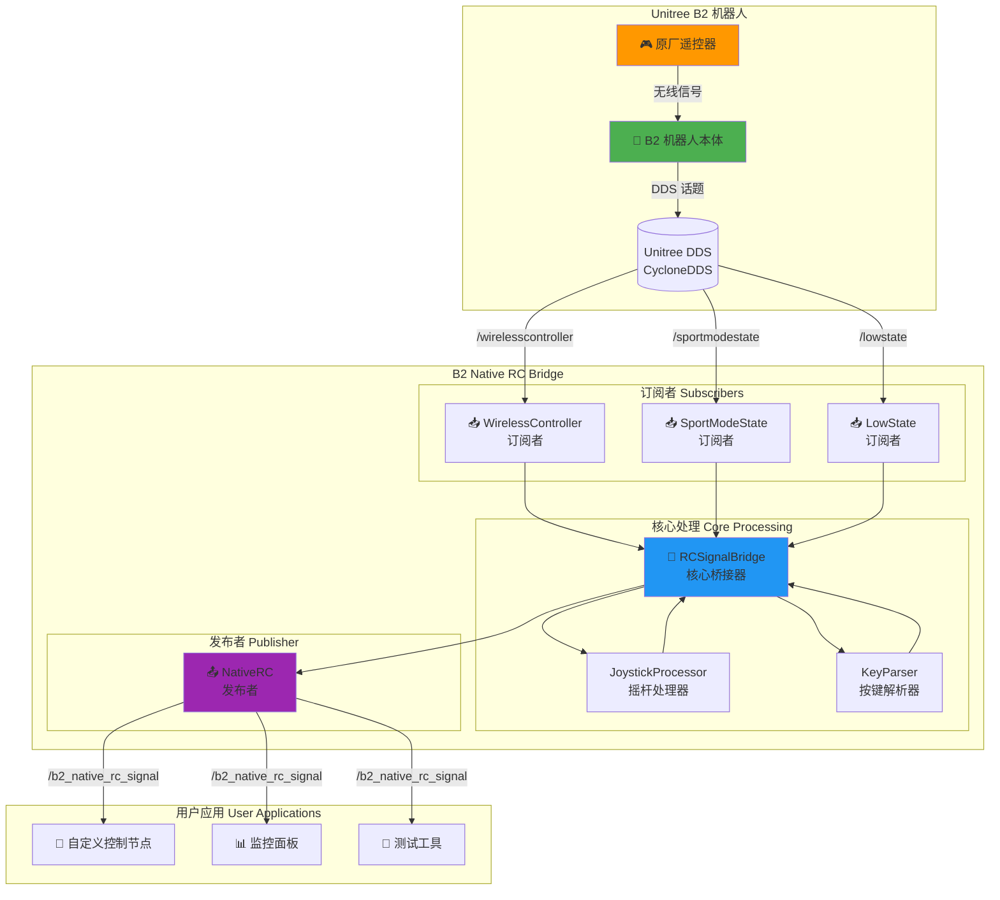
```mermaid
graph TB
    subgraph "Unitree B2 机器人"
        RC[🎮 原厂遥控器]
        B2[🤖 B2 机器人本体]
        DDS[(Unitree DDS<br/>CycloneDDS)]
    end
    
    subgraph "B2 Native RC Bridge"
        subgraph "订阅者 Subscribers"
            SUB1[📥 WirelessController<br/>订阅者]
            SUB2[📥 SportModeState<br/>订阅者]
            SUB3[📥 LowState<br/>订阅者]
        end
        
        subgraph "核心处理 Core Processing"
            BRIDGE[🔄 RCSignalBridge<br/>核心桥接器]
            JP[JoystickProcessor<br/>摇杆处理器]
            KP[KeyParser<br/>按键解析器]
        end
        
        subgraph "发布者 Publisher"
            PUB[📤 NativeRC<br/>发布者]
        end
    end
    
    subgraph "用户应用 User Applications"
        APP1[🚀 自定义控制节点]
        APP2[📊 监控面板]
        APP3[🧪 测试工具]
    end
    
    RC -->|无线信号| B2
    B2 -->|DDS 话题| DDS
    
    DDS -->|/wirelesscontroller| SUB1
    DDS -->|/sportmodestate| SUB2
    DDS -->|/lowstate| SUB3
    
    SUB1 --> BRIDGE
    SUB2 --> BRIDGE
    SUB3 --> BRIDGE
    
    BRIDGE --> JP
    BRIDGE --> KP
    JP --> BRIDGE
    KP --> BRIDGE
    
    BRIDGE --> PUB
    PUB -->|/b2_native_rc_signal| APP1
    PUB -->|/b2_native_rc_signal| APP2
    PUB -->|/b2_native_rc_signal| APP3
    
    style RC fill:#ff9800
    style B2 fill:#4caf50
    style BRIDGE fill:#2196f3
    style PUB fill:#9c27b0
```

### 2.2 模块层次结构

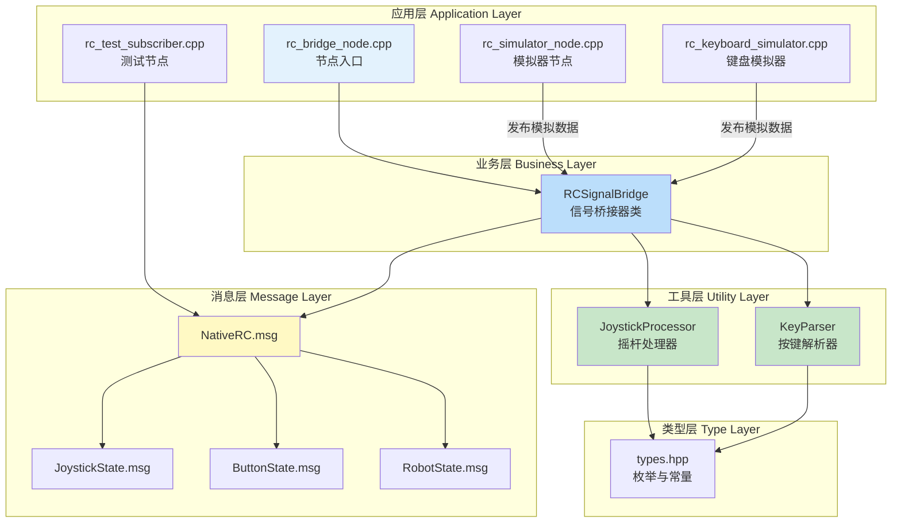
```mermaid
graph TB
    subgraph "应用层 Application Layer"
        NODE[rc_bridge_node.cpp<br/>节点入口]
        TEST[rc_test_subscriber.cpp<br/>测试节点]
        SIM[rc_simulator_node.cpp<br/>模拟器节点]
        KBSIM[rc_keyboard_simulator.cpp<br/>键盘模拟器]
    end
    
    subgraph "业务层 Business Layer"
        BRIDGE[RCSignalBridge<br/>信号桥接器类]
    end
    
    subgraph "工具层 Utility Layer"
        JP[JoystickProcessor<br/>摇杆处理器]
        KP[KeyParser<br/>按键解析器]
    end
    
    subgraph "消息层 Message Layer"
        MSG1[NativeRC.msg]
        MSG2[JoystickState.msg]
        MSG3[ButtonState.msg]
        MSG4[RobotState.msg]
    end
    
    subgraph "类型层 Type Layer"
        TYPES[types.hpp<br/>枚举与常量]
    end
    
    NODE --> BRIDGE
    TEST --> MSG1
    SIM --> |发布模拟数据| BRIDGE
    KBSIM --> |发布模拟数据| BRIDGE
    
    BRIDGE --> JP
    BRIDGE --> KP
    BRIDGE --> MSG1
    
    MSG1 --> MSG2
    MSG1 --> MSG3
    MSG1 --> MSG4
    
    JP --> TYPES
    KP --> TYPES
    
    style NODE fill:#e3f2fd
    style BRIDGE fill:#bbdefb
    style JP fill:#c8e6c9
    style KP fill:#c8e6c9
    style MSG1 fill:#fff9c4
```

---

## 3. 节点与话题关系

### 3.1 ROS2 计算图

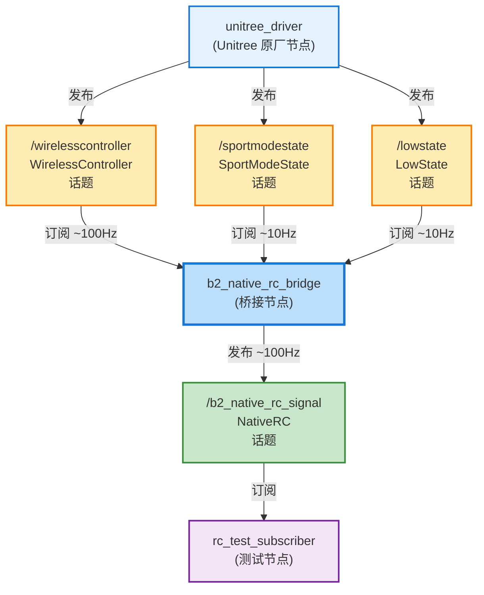
```mermaid
graph TB
    UN1["unitree_driver<br/>(Unitree 原厂节点)"]
    
    T1["/wirelesscontroller<br/>WirelessController<br/>话题"]
    T2["/sportmodestate<br/>SportModeState<br/>话题"]
    T3["/lowstate<br/>LowState<br/>话题"]
    
    BN["b2_native_rc_bridge<br/>(桥接节点)"]
    
    T4["/b2_native_rc_signal<br/>NativeRC<br/>话题"]
    
    TN["rc_test_subscriber<br/>(测试节点)"]
    
    UN1 -->|"发布"| T1
    UN1 -->|"发布"| T2
    UN1 -->|"发布"| T3
    
    T1 -->|"订阅 ~100Hz"| BN
    T2 -->|"订阅 ~10Hz"| BN
    T3 -->|"订阅 ~10Hz"| BN
    
    BN -->|"发布 ~100Hz"| T4
    
    T4 -->|"订阅"| TN
    
    style UN1 fill:#e3f2fd,stroke:#1976d2,stroke-width:2px
    style T1 fill:#ffecb3,stroke:#f57c00,stroke-width:2px
    style T2 fill:#ffecb3,stroke:#f57c00,stroke-width:2px
    style T3 fill:#ffecb3,stroke:#f57c00,stroke-width:2px
    style T4 fill:#c8e6c9,stroke:#388e3c,stroke-width:2px
    style BN fill:#bbdefb,stroke:#1976d2,stroke-width:3px
    style TN fill:#f3e5f5,stroke:#7b1fa2,stroke-width:2px
```

### 3.2 话题详细信息

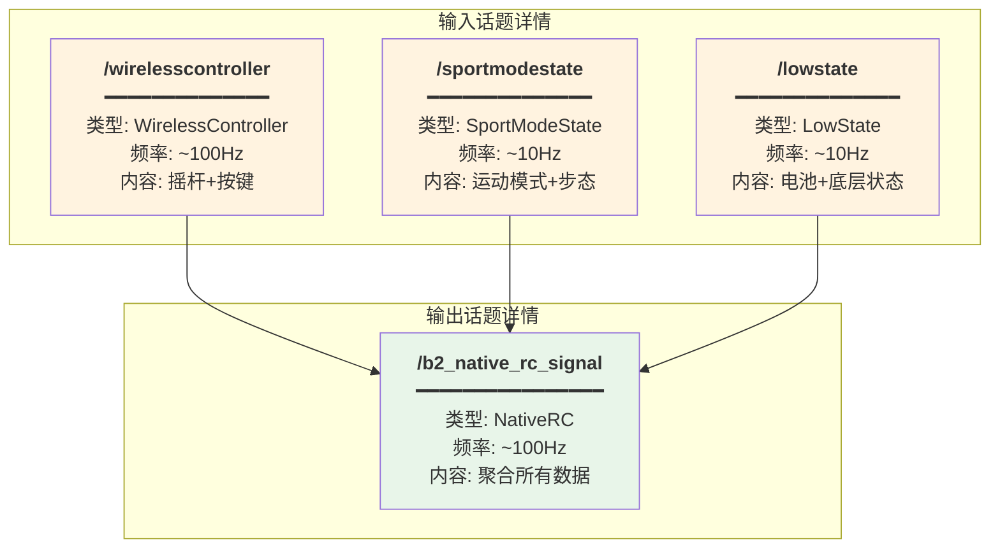
```mermaid
graph TB
    subgraph "输入话题详情"
        direction LR
        I1["<b>/wirelesscontroller</b><br/>━━━━━━━━━━━━━━<br/>类型: WirelessController<br/>频率: ~100Hz<br/>内容: 摇杆+按键"]
        I2["<b>/sportmodestate</b><br/>━━━━━━━━━━━━━━<br/>类型: SportModeState<br/>频率: ~10Hz<br/>内容: 运动模式+步态"]
        I3["<b>/lowstate</b><br/>━━━━━━━━━━━━━━<br/>类型: LowState<br/>频率: ~10Hz<br/>内容: 电池+底层状态"]
    end
    
    subgraph "输出话题详情"
        O1["<b>/b2_native_rc_signal</b><br/>━━━━━━━━━━━━━━━━<br/>类型: NativeRC<br/>频率: ~100Hz<br/>内容: 聚合所有数据"]
    end
    
    I1 --> O1
    I2 --> O1
    I3 --> O1
    
    style I1 fill:#fff3e0
    style I2 fill:#fff3e0
    style I3 fill:#fff3e0
    style O1 fill:#e8f5e9
```

---

## 4. 数据流详解

### 4.1 主数据流

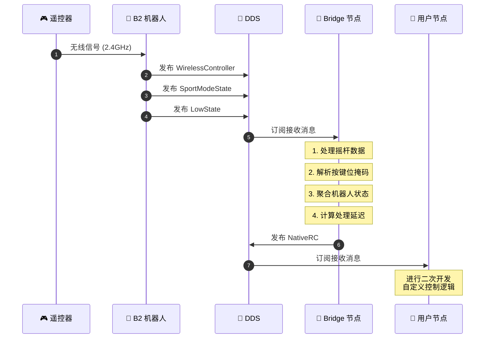
```mermaid
sequenceDiagram
    autonumber
    participant RC as 🎮 遥控器
    participant B2 as 🤖 B2 机器人
    participant DDS as 📡 DDS
    participant Bridge as 🔄 Bridge 节点
    participant User as 👤 用户节点
    
    RC->>B2: 无线信号 (2.4GHz)
    B2->>DDS: 发布 WirelessController
    B2->>DDS: 发布 SportModeState
    B2->>DDS: 发布 LowState
    
    DDS->>Bridge: 订阅接收消息
    
    Note over Bridge: 1. 处理摇杆数据
    Note over Bridge: 2. 解析按键位掩码
    Note over Bridge: 3. 聚合机器人状态
    Note over Bridge: 4. 计算处理延迟
    
    Bridge->>DDS: 发布 NativeRC
    DDS->>User: 订阅接收消息
    
    Note over User: 进行二次开发<br/>自定义控制逻辑
```

### 4.2 回调处理流程

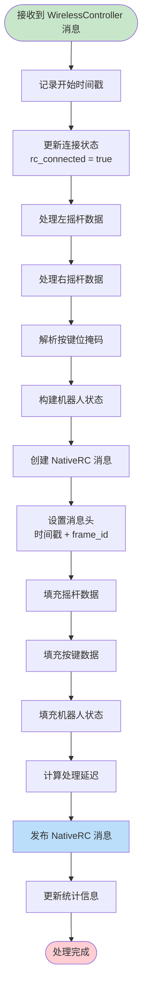
```mermaid
flowchart TD
    START([接收到 WirelessController 消息])
    
    START --> T1[记录开始时间戳]
    T1 --> T2[更新连接状态<br/>rc_connected = true]
    
    T2 --> P1[处理左摇杆数据]
    P1 --> P2[处理右摇杆数据]
    P2 --> P3[解析按键位掩码]
    P3 --> P4[构建机器人状态]
    
    P4 --> B1[创建 NativeRC 消息]
    B1 --> B2[设置消息头<br/>时间戳 + frame_id]
    B2 --> B3[填充摇杆数据]
    B3 --> B4[填充按键数据]
    B4 --> B5[填充机器人状态]
    B5 --> B6[计算处理延迟]
    
    B6 --> PUB[发布 NativeRC 消息]
    PUB --> STAT[更新统计信息]
    
    STAT --> END([处理完成])
    
    style START fill:#c8e6c9
    style END fill:#ffcdd2
    style PUB fill:#bbdefb
```

### 4.3 状态缓存机制

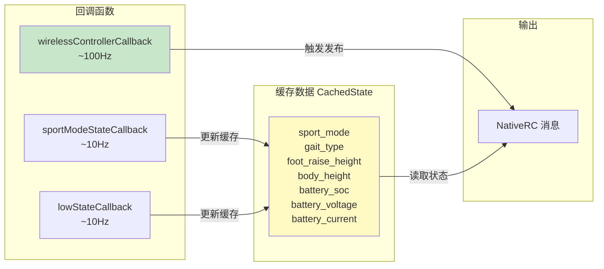
```mermaid
flowchart LR
    subgraph "回调函数"
        CB1[wirelessControllerCallback<br/>~100Hz]
        CB2[sportModeStateCallback<br/>~10Hz]
        CB3[lowStateCallback<br/>~10Hz]
    end
    
    subgraph "缓存数据 CachedState"
        CS["sport_mode<br/>gait_type<br/>foot_raise_height<br/>body_height<br/>battery_soc<br/>battery_voltage<br/>battery_current"]
    end
    
    subgraph "输出"
        OUT[NativeRC 消息]
    end
    
    CB1 -->|触发发布| OUT
    CB2 -->|更新缓存| CS
    CB3 -->|更新缓存| CS
    CS -->|读取状态| OUT
    
    style CS fill:#fff9c4
    style CB1 fill:#c8e6c9
```

---

## 5. 消息结构设计

### 5.1 消息层次关系

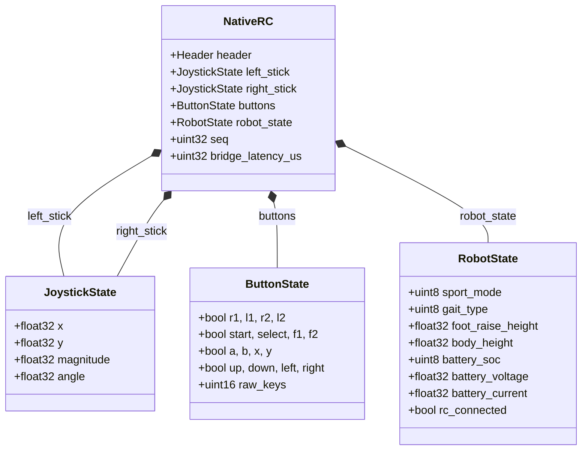
```mermaid
classDiagram
    class NativeRC {
        +Header header
        +JoystickState left_stick
        +JoystickState right_stick
        +ButtonState buttons
        +RobotState robot_state
        +uint32 seq
        +uint32 bridge_latency_us
    }
    
    class JoystickState {
        +float32 x
        +float32 y
        +float32 magnitude
        +float32 angle
    }
    
    class ButtonState {
        +bool r1, l1, r2, l2
        +bool start, select, f1, f2
        +bool a, b, x, y
        +bool up, down, left, right
        +uint16 raw_keys
    }
    
    class RobotState {
        +uint8 sport_mode
        +uint8 gait_type
        +float32 foot_raise_height
        +float32 body_height
        +uint8 battery_soc
        +float32 battery_voltage
        +float32 battery_current
        +bool rc_connected
    }
    
    NativeRC *-- JoystickState : left_stick
    NativeRC *-- JoystickState : right_stick
    NativeRC *-- ButtonState : buttons
    NativeRC *-- RobotState : robot_state
```

### 5.2 JoystickState 坐标系统

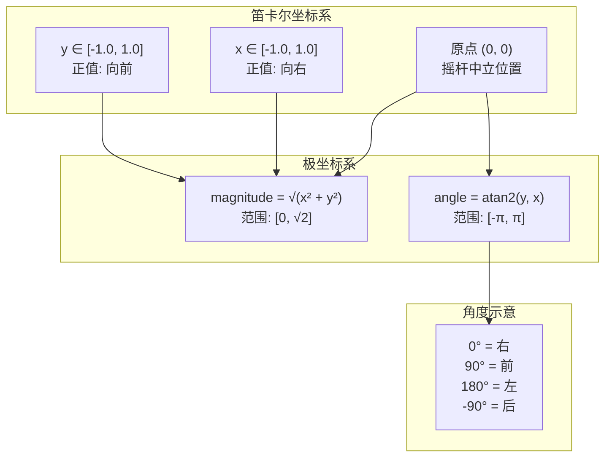
```mermaid
graph TB
    subgraph "笛卡尔坐标系"
        direction TB
        C1["原点 (0, 0)<br/>摇杆中立位置"]
        C2["x ∈ [-1.0, 1.0]<br/>正值: 向右"]
        C3["y ∈ [-1.0, 1.0]<br/>正值: 向前"]
    end
    
    subgraph "极坐标系"
        direction TB
        P1["magnitude = √(x² + y²)<br/>范围: [0, √2]"]
        P2["angle = atan2(y, x)<br/>范围: [-π, π]"]
    end
    
    subgraph "角度示意"
        A1["0° = 右<br/>90° = 前<br/>180° = 左<br/>-90° = 后"]
    end
    
    C1 --> P1
    C2 --> P1
    C3 --> P1
    C1 --> P2
    P2 --> A1
```

### 5.3 ButtonState 位掩码布局

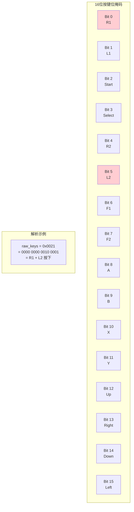
```mermaid
graph TB
    subgraph "16位按键位掩码"
        direction LR
        B0["Bit 0<br/>R1"]
        B1["Bit 1<br/>L1"]
        B2["Bit 2<br/>Start"]
        B3["Bit 3<br/>Select"]
        B4["Bit 4<br/>R2"]
        B5["Bit 5<br/>L2"]
        B6["Bit 6<br/>F1"]
        B7["Bit 7<br/>F2"]
        B8["Bit 8<br/>A"]
        B9["Bit 9<br/>B"]
        B10["Bit 10<br/>X"]
        B11["Bit 11<br/>Y"]
        B12["Bit 12<br/>Up"]
        B13["Bit 13<br/>Right"]
        B14["Bit 14<br/>Down"]
        B15["Bit 15<br/>Left"]
    end
    
    subgraph "解析示例"
        E1["raw_keys = 0x0021<br/>= 0000 0000 0010 0001<br/>= R1 + L2 按下"]
    end
    
    style B0 fill:#ffcdd2
    style B5 fill:#ffcdd2
```

---

## 6. 核心类设计

### 6.1 类关系图

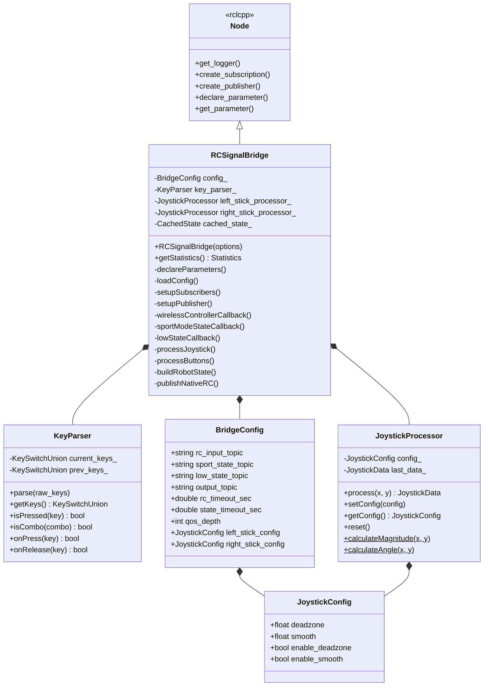
```mermaid
classDiagram
    class Node {
        <<rclcpp>>
        +get_logger()
        +create_subscription()
        +create_publisher()
        +declare_parameter()
        +get_parameter()
    }
    
    class RCSignalBridge {
        -BridgeConfig config_
        -KeyParser key_parser_
        -JoystickProcessor left_stick_processor_
        -JoystickProcessor right_stick_processor_
        -CachedState cached_state_
        +RCSignalBridge(options)
        +getStatistics() Statistics
        -declareParameters()
        -loadConfig()
        -setupSubscribers()
        -setupPublisher()
        -wirelessControllerCallback()
        -sportModeStateCallback()
        -lowStateCallback()
        -processJoystick()
        -processButtons()
        -buildRobotState()
        -publishNativeRC()
    }
    
    class KeyParser {
        -KeySwitchUnion current_keys_
        -KeySwitchUnion prev_keys_
        +parse(raw_keys)
        +getKeys() KeySwitchUnion
        +isPressed(key) bool
        +isCombo(combo) bool
        +onPress(key) bool
        +onRelease(key) bool
    }
    
    class JoystickProcessor {
        -JoystickConfig config_
        -JoystickData last_data_
        +process(x, y) JoystickData
        +setConfig(config)
        +getConfig() JoystickConfig
        +reset()
        +calculateMagnitude(x, y)$
        +calculateAngle(x, y)$
    }
    
    class BridgeConfig {
        +string rc_input_topic
        +string sport_state_topic
        +string low_state_topic
        +string output_topic
        +double rc_timeout_sec
        +double state_timeout_sec
        +int qos_depth
        +JoystickConfig left_stick_config
        +JoystickConfig right_stick_config
    }
    
    class JoystickConfig {
        +float deadzone
        +float smooth
        +bool enable_deadzone
        +bool enable_smooth
    }
    
    Node <|-- RCSignalBridge
    RCSignalBridge *-- KeyParser
    RCSignalBridge *-- JoystickProcessor
    RCSignalBridge *-- BridgeConfig
    BridgeConfig *-- JoystickConfig
    JoystickProcessor *-- JoystickConfig
```

### 6.2 RCSignalBridge 初始化流程

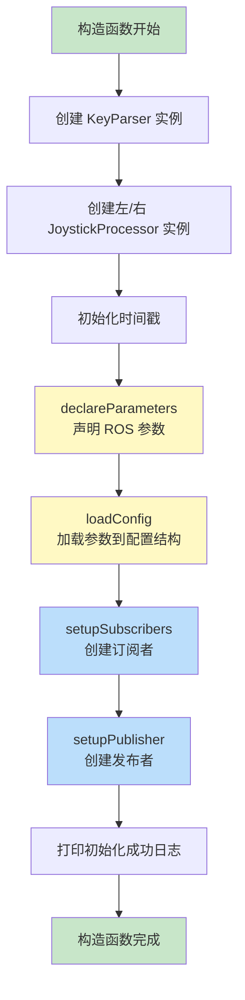
```mermaid
flowchart TD
    CTOR[构造函数开始]
    
    CTOR --> I1[创建 KeyParser 实例]
    I1 --> I2[创建左/右 JoystickProcessor 实例]
    I2 --> I3[初始化时间戳]
    
    I3 --> P1[declareParameters<br/>声明 ROS 参数]
    P1 --> P2[loadConfig<br/>加载参数到配置结构]
    
    P2 --> S1[setupSubscribers<br/>创建订阅者]
    S1 --> S2[setupPublisher<br/>创建发布者]
    
    S2 --> LOG[打印初始化成功日志]
    LOG --> DONE[构造函数完成]
    
    style CTOR fill:#c8e6c9
    style DONE fill:#c8e6c9
    style P1 fill:#fff9c4
    style P2 fill:#fff9c4
    style S1 fill:#bbdefb
    style S2 fill:#bbdefb
```

---

## 7. 摇杆数据处理流程

### 7.1 处理流程

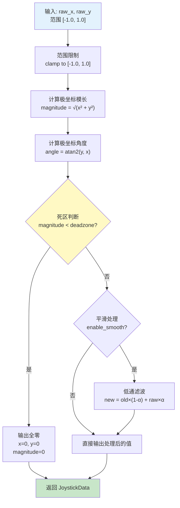
```mermaid
flowchart TD
    INPUT["输入: raw_x, raw_y<br/>范围 [-1.0, 1.0]"]
    
    INPUT --> CLAMP["范围限制<br/>clamp to [-1.0, 1.0]"]
    
    CLAMP --> MAG["计算极坐标模长<br/>magnitude = √(x² + y²)"]
    MAG --> ANG["计算极坐标角度<br/>angle = atan2(y, x)"]
    
    ANG --> DZ{死区判断<br/>magnitude < deadzone?}
    
    DZ -->|是| ZERO["输出全零<br/>x=0, y=0<br/>magnitude=0"]
    DZ -->|否| SMOOTH{平滑处理<br/>enable_smooth?}
    
    SMOOTH -->|是| LOWPASS["低通滤波<br/>new = old×(1-α) + raw×α"]
    SMOOTH -->|否| OUTPUT["直接输出处理后的值"]
    
    LOWPASS --> OUTPUT
    ZERO --> FINAL[返回 JoystickData]
    OUTPUT --> FINAL
    
    style INPUT fill:#e3f2fd
    style FINAL fill:#c8e6c9
    style DZ fill:#fff9c4
```

### 7.2 死区处理可视化

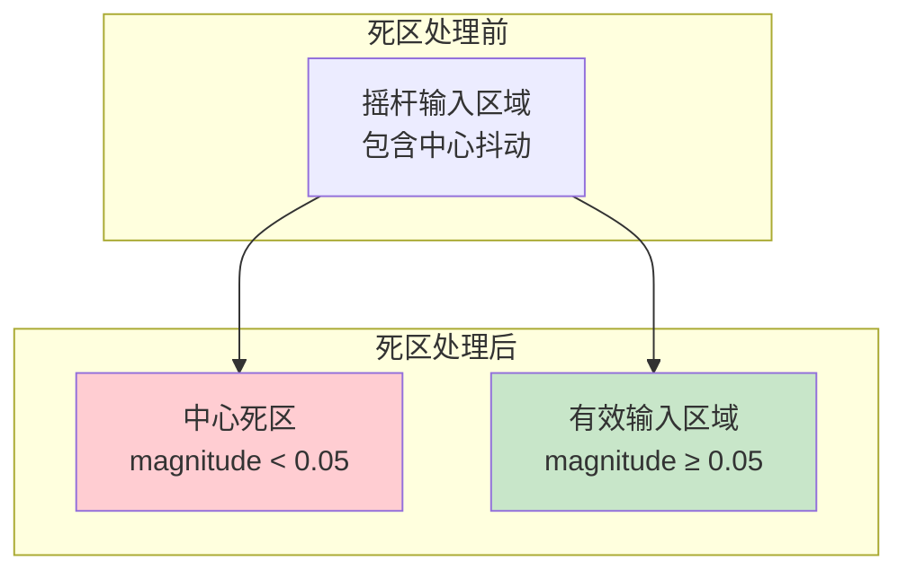
```mermaid
graph TB
    subgraph "死区处理前"
        R1["摇杆输入区域<br/>包含中心抖动"]
    end
    
    subgraph "死区处理后"
        R2["中心死区<br/>magnitude < 0.05"]
        R3["有效输入区域<br/>magnitude ≥ 0.05"]
    end
    
    R1 --> R2
    R1 --> R3
    
    style R2 fill:#ffcdd2
    style R3 fill:#c8e6c9
```

---

## 8. 按键解析流程

### 8.1 位掩码解析

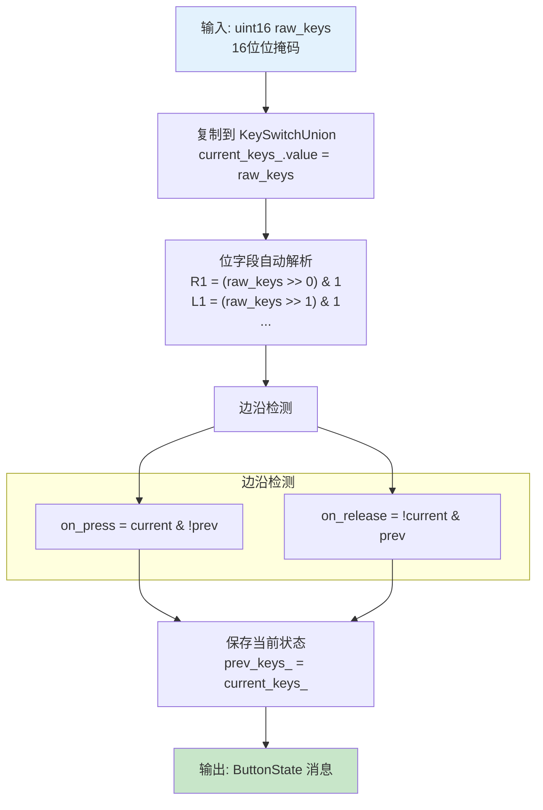
```mermaid
flowchart TD
    INPUT["输入: uint16 raw_keys<br/>16位位掩码"]
    
    INPUT --> UNION["复制到 KeySwitchUnion<br/>current_keys_.value = raw_keys"]
    
    UNION --> PARSE["位字段自动解析<br/>R1 = (raw_keys >> 0) & 1<br/>L1 = (raw_keys >> 1) & 1<br/>..."]
    
    PARSE --> EDGE["边沿检测"]
    
    subgraph "边沿检测"
        E1["on_press = current & !prev"]
        E2["on_release = !current & prev"]
    end
    
    EDGE --> E1
    EDGE --> E2
    E1 --> SAVE["保存当前状态<br/>prev_keys_ = current_keys_"]
    E2 --> SAVE
    
    SAVE --> OUTPUT["输出: ButtonState 消息"]
    
    style INPUT fill:#e3f2fd
    style OUTPUT fill:#c8e6c9
```

### 8.2 组合键检测

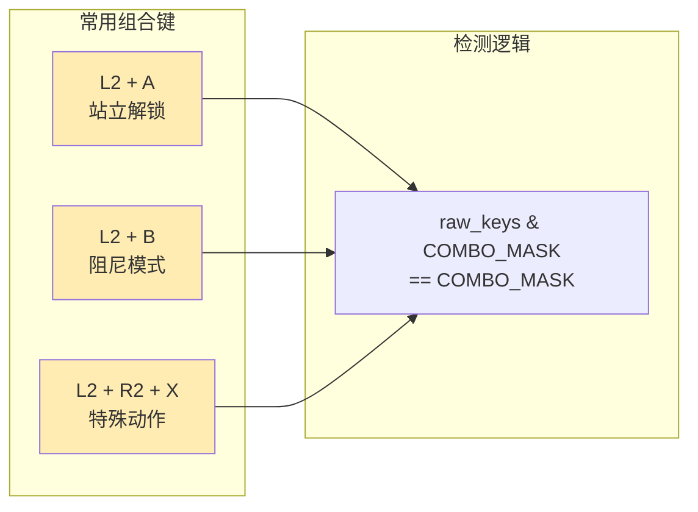
```mermaid
flowchart LR
    subgraph "常用组合键"
        C1["L2 + A<br/>站立解锁"]
        C2["L2 + B<br/>阻尼模式"]
        C3["L2 + R2 + X<br/>特殊动作"]
    end
    
    subgraph "检测逻辑"
        L1["raw_keys & COMBO_MASK<br/>== COMBO_MASK"]
    end
    
    C1 --> L1
    C2 --> L1
    C3 --> L1
    
    style C1 fill:#ffecb3
    style C2 fill:#ffecb3
    style C3 fill:#ffecb3
```

---

## 9. 项目文件结构

### 9.1 目录结构图

```mermaid
graph TB
    ROOT[B2_ROS_Signal/]
    
    ROOT --> CMAKE[CMakeLists.txt]
    ROOT --> PKG[package.xml]
    ROOT --> README[README.md]
    
    ROOT --> MSG[msg/]
    MSG --> M1[NativeRC.msg]
    MSG --> M2[JoystickState.msg]
    MSG --> M3[ButtonState.msg]
    MSG --> M4[RobotState.msg]
    
    ROOT --> INCLUDE[include/b2_native_rc_interface/]
    INCLUDE --> TYPES[types.hpp]
    INCLUDE --> BR[bridge/]
    BR --> BR1[rc_signal_bridge.hpp]
    INCLUDE --> UT[utils/]
    UT --> UT1[key_parser.hpp]
    UT --> UT2[joystick_processor.hpp]
    
    ROOT --> SRC[src/]
    SRC --> SRCBR[bridge/]
    SRCBR --> SB1[rc_signal_bridge.cpp]
    SRC --> NODES[nodes/]
    NODES --> N1[rc_bridge_node.cpp]
    NODES --> N2[rc_test_subscriber.cpp]
    NODES --> N3[rc_simulator_node.cpp]
    NODES --> N4[rc_keyboard_simulator.cpp]
    SRC --> SRCUTIL[utils/]
    SRCUTIL --> SU1[key_parser.cpp]
    SRCUTIL --> SU2[joystick_processor.cpp]
    
    ROOT --> LAUNCH[launch/]
    LAUNCH --> L1[rc_bridge.launch.py]
    LAUNCH --> L2[rc_bridge_with_test.launch.py]
    LAUNCH --> L3[rc_simulator.launch.py]
    LAUNCH --> L4[rc_keyboard_test.launch.py]
    
    ROOT --> CONFIG[config/]
    CONFIG --> CF1[rc_bridge_params.yaml]
    
    ROOT --> TEST[test/]
    TEST --> T1[test_key_parser.cpp]
    
    ROOT --> DOCS[docs/]
    DOCS --> D1[PROJECT_GUIDE.md]
    DOCS --> D2[LOCAL_TESTING_GUIDE.md]
    
    style ROOT fill:#e3f2fd
    style MSG fill:#fff9c4
    style INCLUDE fill:#c8e6c9
    style SRC fill:#bbdefb
    style LAUNCH fill:#f3e5f5
```

### 9.2 文件功能说明

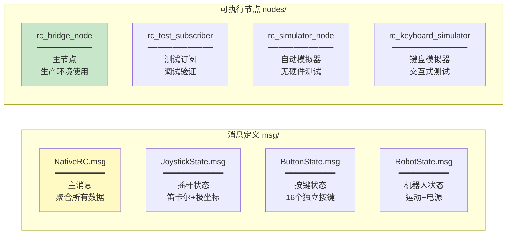
```mermaid
graph LR
    subgraph "消息定义 msg/"
        M1["NativeRC.msg<br/>━━━━━━━━━━<br/>主消息<br/>聚合所有数据"]
        M2["JoystickState.msg<br/>━━━━━━━━━━━━<br/>摇杆状态<br/>笛卡尔+极坐标"]
        M3["ButtonState.msg<br/>━━━━━━━━━━<br/>按键状态<br/>16个独立按键"]
        M4["RobotState.msg<br/>━━━━━━━━━━<br/>机器人状态<br/>运动+电源"]
    end
    
    subgraph "可执行节点 nodes/"
        N1["rc_bridge_node<br/>━━━━━━━━━━━<br/>主节点<br/>生产环境使用"]
        N2["rc_test_subscriber<br/>━━━━━━━━━━━━━<br/>测试订阅<br/>调试验证"]
        N3["rc_simulator_node<br/>━━━━━━━━━━━━━<br/>自动模拟器<br/>无硬件测试"]
        N4["rc_keyboard_simulator<br/>━━━━━━━━━━━━━━━<br/>键盘模拟器<br/>交互式测试"]
    end
    
    style M1 fill:#fff9c4
    style N1 fill:#c8e6c9
```

---

## 10. 启动流程

### 10.1 Launch 文件关系

```mermaid
graph TB
    subgraph "启动文件"
        L1[rc_bridge.launch.py<br/>标准启动]
        L2[rc_bridge_with_test.launch.py<br/>带测试启动]
        L3[rc_simulator.launch.py<br/>模拟器启动]
        L4[rc_keyboard_test.launch.py<br/>键盘测试启动]
        L5[rc_full_simulation.launch.py<br/>完整模拟启动]
    end
    
    subgraph "节点"
        N1[rc_bridge_node]
        N2[rc_test_subscriber]
        N3[rc_simulator_node]
        N4[rc_keyboard_simulator]
    end
    
    L1 --> N1
    L2 --> N1
    L2 --> N2
    L3 --> N3
    L4 --> N4
    L4 --> N1
    L4 --> N2
    L5 --> N3
    L5 --> N1
    L5 --> N2
    
    style L1 fill:#e8f5e9
    style L4 fill:#fff3e0
    style L5 fill:#fce4ec
```

### 10.2 参数加载流程

```mermaid
sequenceDiagram
    participant User as 用户
    participant Launch as Launch 文件
    participant Node as RCSignalBridge 节点
    participant Config as YAML 配置文件
    
    User->>Launch: ros2 launch ... config_file:=xxx.yaml
    Launch->>Config: 读取配置文件路径
    Launch->>Node: 启动节点并传递参数
    
    Node->>Node: declareParameters()<br/>声明参数及默认值
    Node->>Node: loadConfig()<br/>从参数服务器读取
    
    Note over Node: 参数优先级:<br/>1. 命令行参数<br/>2. Launch 参数<br/>3. YAML 文件<br/>4. 默认值
    
    Node->>Node: 初始化完成
```

---

## 11. 测试与调试工具

### 11.1 测试工具概览

```mermaid
graph TB
    subgraph "无硬件测试方案"
        direction TB
        A1[rc_simulator_node<br/>自动生成测试数据]
        A2[rc_keyboard_simulator<br/>键盘实时控制]
    end
    
    subgraph "验证工具"
        B1[rc_test_subscriber<br/>订阅并打印消息]
        B2[ros2 topic echo<br/>命令行查看]
    end
    
    subgraph "完整测试流程"
        C1[启动模拟器]
        C2[启动桥接节点]
        C3[启动测试订阅者]
        C4[观察输出验证]
    end
    
    A1 --> C1
    A2 --> C1
    C1 --> C2
    C2 --> C3
    C3 --> C4
    B1 --> C4
    B2 --> C4
    
    style A1 fill:#fff3e0
    style A2 fill:#fff3e0
    style B1 fill:#e8f5e9
```

### 11.2 键盘模拟器控制映射

```mermaid
graph TB
    subgraph "左摇杆控制"
        LK["W/S - 前进/后退 (Y轴)<br/>A/D - 左/右平移 (X轴)"]
    end
    
    subgraph "右摇杆控制"
        RK["I/K - 上/下 (Y轴)<br/>J/L - 左/右 (X轴)"]
    end
    
    subgraph "按键模拟"
        BK["1-8: R1, L1, R2, L2, START, SELECT, F1, F2<br/>Q/E: A, B<br/>Z/C: X, Y<br/>方向键: UP, DOWN, LEFT, RIGHT"]
    end
    
    subgraph "控制命令"
        CK["R - 重置所有值<br/>ESC - 退出"]
    end
    
    style LK fill:#bbdefb
    style RK fill:#bbdefb
    style BK fill:#fff9c4
    style CK fill:#ffcdd2
```

### 11.3 调试流程

```mermaid
flowchart TD
    START([开始调试])
    
    START --> Q1{有 B2 硬件?}
    
    Q1 -->|是| REAL[连接真实 B2]
    Q1 -->|否| SIM[选择模拟器]
    
    SIM --> S1{模拟方式?}
    S1 -->|自动| AUTO[ros2 launch rc_simulator.launch.py]
    S1 -->|键盘| KB[ros2 launch rc_keyboard_test.launch.py]
    
    REAL --> LAUNCH[ros2 launch rc_bridge.launch.py]
    AUTO --> LAUNCH
    KB --> LAUNCH
    
    LAUNCH --> TEST[启动测试订阅者]
    TEST --> VERIFY[验证消息输出]
    
    VERIFY --> Q2{输出正确?}
    Q2 -->|是| SUCCESS([调试成功])
    Q2 -->|否| DEBUG[检查日志<br/>ros2 topic list<br/>ros2 topic hz]
    DEBUG --> VERIFY
    
    style START fill:#c8e6c9
    style SUCCESS fill:#c8e6c9
    style SIM fill:#fff3e0
```
